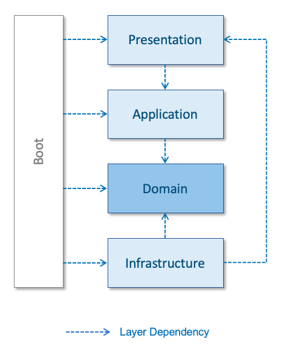

개발 가이드
===
___
[개발 가이드 컨플루언스 링크](https://lguplus-msa-dev.atlassian.net/wiki/spaces/LGUPLUSMSA/pages/1028784196)

## 레이어드 아키텍처 개요
+ 레이어드(계층형) 아키텍처(Layered Architecture)는 수행 역할에 따라 각 레이어(계층)*를 명시적으로 분리
+ 각 레이어 역할에 맞는 소스코드 및 의존성 구성 목표
+ Domain 레이어는 비즈니스 업무로직이 구현되는 핵심 레이어이므로, 다른 레이어의 영향을 최소한으로 받도록 구성

